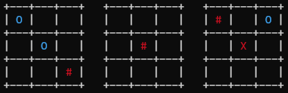

# M,N,K-Game 

Reinforcement Learning approach to Crosses-and-Noughts (TicTacToe) and it's various generalizations.

## Motivation

## Games

### Classical Tic Tac Toe
<p align="center"></p>

Tic-Tac-Toe<sup>[[1]](#1)</sup> is a well-know pencil-and-paper game, played by two players: X-player, 
or Crosses and O-player, or Noughts. The goal is to make 3 figures, X or O, in a
horizontal line, vertical line, or any of two diagonals, on a boards with size 3x3.
The state space consists of 5478<sup>[[2]](#2)</sup> different positions, which can be further reduces 
to 765<sup>[[1]](#1)</sup> due to symmetries. The limited state space size makes Tic-Tac-Toe a perfect 
playground for Reinforcement Learning tabular methods.

### General M,N,K-game
<p align="center"></p>

*m,n,k*-game<sup>[[3]](#3)</sup> is a generalization of Tic-Tac-Toe to wider boards and longer lines.
The board is of size `m x n`, and the goal is to place `k` crosses or nought in a row.
Some examples of such game are Connect Four<sup>[[4]](#4)</sup> which is `(7,6,4)`, Gomoku<sup>[[5]](#5)</sup> which is 
`(15,15,5)` or `(19,19,5)` (the Go board), Connect Six<sup>[[6]](#6)</sup> which is `(19,19,6)` or even `(59,59,6)`. 

Crosses player makes first move, so it always has advantage. Therefore, for perfect play 
two outcomes are possible: crosses player always wins, and there is always a draw. 
This outcome depends on game parameters, `m`, `n`, and `k`. 

*m,n,k*-game is widely studied, and following results are known:
* if `(M,N,K)` is a draw, `(m,n,k)` is a draw as well if either `K`&leq;`k` 
or `M x N` board is bigger than `m x n` board, since if it is not possible to make shorter 
line on a bigger board, it is also impossible to make longer line on a smaller board
* conversely, if `(M,N,K)` is a win, `(m,n,k)` is a win as well if either `K`&geq;`k` 
or `M x N` board is smaller than `m x n` board, since if it is possible to make longer
line on a smaller board, it is also possible to make shorter line on a bigger board
* `(3,3,3)`, or classical Tic-Tac-Toe is a draw
* `(3,4,3)` and `(4,3,3)` are wins, it implies that `(m,n,3)` is also a win if `m+n`&geq;`7`
* `(5,5,4)` is a draw, it implies `(4,4,4)` and `(5,4,4)` are draws as well
* `(6,5,4)` is a win, it implies that, in particular, Connect Four<sup>[[4]](#4)</sup> is a win as well
* `(8,8,5)` is a draw, it implies `(m,n,5)` is a draw for any `m`&leq;`8` and `n`&leq;`8`
* `(15,15,5)`, or Gomoku<sup>[[5]](#5)</sup> is a win

### 3D Tic Tac Toe
<p align="center"></p>

<p align="center"></p>

Another generalization of classical Tic-Tac-Toe is make the board multidimensional `N^d` 
hypercube<sup>[[7]](#7)</sup>. Few examples are `3^3` or 3D Tic-Tac-Toe<sup>[[8]](#8)</sup>, 
and `4^3` known as Qubic<sup>[[9]](#9)</sup>, which is a Tic-Tac-Toe on a `4 x 4 x 4` board and a line is made of 4 symbols.
The number of winning combinations (lines) for `N^d` game is<sup>[[10]](#10)</sup>
```
    (N+2)^d - (N^d)       
    ---------------
           2
```
for `d=3` it is reduced to the polynomial `3*N^2 + 6*N + 4`.

Conclusions similar to existing to *m,n,k*-game can be made in the case of multidimensional Tic Tac Toe,
and following results are known:
* If `d`- dimensional game is a win, any `D`- dimensional game is a win as well for `D`&geq;`d`, 
since there is always possible to reduce the game on `d`- dimensional hyperplane of `D`- dimensional board
* If `D`- dimensional game is a draw, any `d`- dimensional game is a draw as well for `d`&leq;`D`, 
since if it is not possible to make a line in an outer space, it is also impossible to make it
in any hyperplane
* `3 x 3 x 3` 3D Tic-Tac-Toe<sup>[[8]](#8)</sup> is a win in a simple way, it has `49` winning combinations:
  * `8` for each of 3 hyperplanes
  * `9` verticals
  * `6` xz and `6` yz diagonals
  * `4` xyz diagonals
* `4 x 4 x 4`, or Qubic<sup>[[9]](#9)</sup> is also a win, however explicit win strategy is more difficult, 
it has `76` winning combinations:
  * `10` for each of 4 hyperplanes
  * `16` verticals
  * `8` xz and `8` yz diagonals
  * `4` xyz diagonals
* `N^d` game is a draw<sup>[[1]](#1)</sup> if
  * `N` is odd and `N`&geq;`3^d-1`, for 3d it means `N=27,29,31,...`
  * `N` is even and `N`&geq;`2^d-2`, for 3d it means `N=6,8,10,...`

### Ultimate Tic Tac Toe
<p align="center"></p>

Ultimate Tic-Tac-Toe or Super Tic-Tac-Toe<sup>[[11]](#11)</sup> is a fractal generalization of classical Tic-Tac-Toe.
The board size is `9 x 9`, and this board is viewed as a `3 x 3` super-board of `3 x 3 ` sub-boards.
Move on a sub-board determines a super-board, where the opponent should make the next move.
For example, if the last move is to the upper-right corner of any sub-board, 
then the opponent can only play on upper-right corner super-board. 

Each sub board can be a draw, or can be won by any of player. Winner is the player who
can build it's won sub-board in a line. If no more moves can be done and none of
two players has winning line, it's a draw.

The following variations are known:
* Standard Ultimate Tic-Tac-Toe, where sub-board where any of two players has already
won is sealed, and if a player is directed to this sub-board, it can make next move
on any board which is not yet sealed
* Alternative Ultimate Tic-Tac-Toe where already won sub-boards are not sealed, and
can be used for further play. It was shown that this version is a won<sup>[[12]](#12)</sup>
* Tic-Tac-Ku, where winner is a player winning at least 5 of 9 sub-boards 

Ultimate Tic-Tac-Toe can also be generalized in an *m,n,k*-game similar way. For example, 
one can consider Ultimate 4,4,4-game which is played on a `4 x 4` super-board made 
of `4 x 4` sub-boards and the goal is to win on the super-board 4 sub-boards in a line.

The sub-boards and super-board do not necessary have square form, one can play 
Ultimate 4,3,3-game which is played on `4 x 3` super board made of `4 x 3` sub-boards 
and the goal is to win on the super-board 3 sub-boards in a line.

<p align="center"></p>

<p align="center"></p>

## Policies

### MCTS

### PUCT approach

### References
<a id="1">[1]</a> [Tic-Tac-Toe](https://en.wikipedia.org/wiki/Tic-tac-toe) </br>
<a id="2">[2]</a> [TicTacToe State Space Choose Calculation](https://math.stackexchange.com/questions/485752/tictactoe-state-space-choose-calculation])</br>
<a id="3">[3]</a> [*m,n,k*-game](https://en.wikipedia.org/wiki/M,n,k-game)</br>
<a id="4">[4]</a> [Connect Four](https://en.wikipedia.org/wiki/Connect_Four)</br>
<a id="5">[5]</a> [Gomoku](https://en.wikipedia.org/wiki/Gomoku)</br>
<a id="6">[6]</a> [Connect 6](https://en.wikipedia.org/wiki/Connect6)</br>
<a id="7">[7]</a> [*N<sup>d</sup>*-game](https://en.wikipedia.org/wiki/Nd_game)</br>
<a id="8">[8]</a> [3D Tic-Tac-Toe](https://en.wikipedia.org/wiki/3D_tic-tac-toe)</br>
<a id="9">[9]</a> [Qubic](https://gambiter.com/tabletop/Qubic.html)</br>
<a id="10">[10]</a> [Hypercube Tic-Tac-Toe, Golomn, Hales, 2002](https://projecteuclid-org.cycle.msri.org/books/Book42/files/golomb.pdf)</br>
<a id="11">[11]</a> [Ultimate Tic-Tac-Toe](https://en.wikipedia.org/wiki/Ultimate_tic-tac-toe)</br>
<a id="12">[12]</a> [At Most 43 Moves, At Least 29: Optimal Strategies and Bounds for Ultimate Tic-Tac-Toe, Bertholon et al, 2020](https://arxiv.org/abs/2006.02353v2)</br>
 


